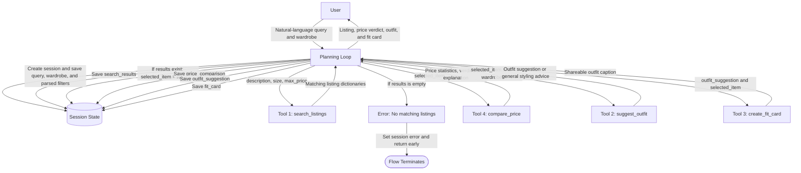

# FitFindr - planning.md

> Complete this document before writing any implementation code.

---

## Tools

### Tool 1: search_listings

**What it does:**
Searches the mock listings dataset for items that match the user's description, optional size, and optional maximum price. It lowercases and tokenizes the description, counts each whole-word occurrence across the listing's title, description, category, and style tags, drops zero-score listings, and sorts by descending score with dataset order as the tie-breaker.

**Input parameters:**
- `description` (str): Keywords describing the requested item, such as `"vintage graphic tee"`.
- `size` (str | None): The requested size, matched case-insensitively; `None` means any size.
- `max_price` (float | None): The highest acceptable price in dollars, inclusive; `None` means no price limit.

**What it returns:**
Returns a `list[dict]` sorted from best to worst match. Each dictionary contains `id`, `title`, `description`, `category`, `style_tags`, `size`, `condition`, `price`, `colors`, `brand`, and `platform`.

**What happens if it fails or returns nothing:**
If no items match, it returns an empty list instead of raising an error. The agent stops the remaining tool calls, tells the user no exact matches were found, and suggests relaxing the size, description, or price limit.

---

### Tool 2: suggest_outfit

**What it does:**
Uses the selected listing and the user's wardrobe to suggest one or two complete outfits. It names specific wardrobe pieces that match the new item's colors, category, and style.

**Input parameters:**
- `new_item` (dict): The selected listing, including its title, category, colors, style tags, size, condition, price, brand, and platform.
- `wardrobe` (dict): A dictionary with an `items` list; each item contains `id`, `name`, `category`, `colors`, `style_tags`, and optional `notes`.

**What it returns:**
Returns a non-empty `str` containing one or two outfit combinations. Each combination identifies the new item, names the wardrobe pieces to wear with it, and briefly explains the outfit's style or color coordination.

**What happens if it fails or returns nothing:**
If the wardrobe is empty or too limited, the tool returns general suggestions for item categories, colors, and styles that would pair with the new item. If the LLM fails or returns blank text, the agent uses a simple fallback suggestion based on the item's category, colors, and style tags.

---

### Tool 3: create_fit_card

**What it does:**
Turns the selected listing and outfit suggestion into a short, shareable outfit caption. The caption sounds like a casual outfit-of-the-day post rather than a product description.

**Input parameters:**
- `outfit` (str): The complete outfit suggestion returned by `suggest_outfit`.
- `new_item` (dict): The selected listing whose title, price, platform, and style details should appear in the caption.

**What it returns:**
Returns a `str` containing a two-to-four-sentence caption. It mentions the selected item's name, price, and platform once, describes the outfit's vibe, and varies based on the supplied item and outfit.

**What happens if it fails or returns nothing:**
If `outfit` is empty or the listing is missing required details, the tool returns a clear error message instead of raising an exception. If the LLM fails, the agent creates a basic caption from the available item title, price, platform, and outfit text.

---

### Tool 4: compare_price

**What it does:**
Estimates whether the selected item's price is a good deal by comparing it with similar listings in the dataset. Comparable listings share the same category and at least one style tag, with brand and condition used as extra similarity signals.

**Input parameters:**
- `item` (dict): The selected listing, including `id`, `category`, `style_tags`, `brand`, `condition`, and numeric `price`.

**What it returns:**
Returns a `dict` containing `item_price` (float), `comparable_count` (int), `average_price` (float), `median_price` (float), `price_difference` (float, item price minus median), `verdict` (str: `"good deal"`, `"fair"`, `"overpriced"`, or `"unknown"`), and `explanation` (str). A price at least 10% below the median is a good deal, within 10% is fair, and more than 10% above the median is overpriced.

**What happens if it fails or returns nothing:**
The tool first tries same-category listings with overlapping style tags, excluding the selected item. If fewer than two are found, it falls back to other listings in the same category; if none exist or the price is invalid, it returns an `"unknown"` verdict with an explanation, and the agent continues with outfit creation.

---

## Planning Loop

**How does your agent decide which tool to call next?**
1. Create a new session and parse the user query into `description`, `size`, and `max_price`. Store these values in `session["parsed"]`; if size or price is not mentioned, store `None` for that value.
2. Call `search_listings` with the parsed values and store its return value in `session["search_results"]`. If the list is empty, set `session["error"]` to a helpful no-results message and return the session immediately.
3. If results exist, set `session["selected_item"] = session["search_results"][0]`. The first result is used because search results are already sorted by relevance.
4. Call `compare_price` with `session["selected_item"]` and store the returned dictionary in `session["price_comparison"]`. If its verdict is `"unknown"`, keep the explanation and continue because a price comparison is not required to create an outfit.
5. Call `suggest_outfit` with the selected item and `session["wardrobe"]`. Store the returned string in `session["outfit_suggestion"]`; if it is empty, create and store a basic rule-based styling suggestion using the item's category, colors, and style tags.
6. Call `create_fit_card` with the outfit suggestion and selected item. Store the returned string in `session["fit_card"]`; if it is empty, create a basic caption using the item's title, price, platform, and outfit suggestion.
7. Return the completed session when `selected_item`, `price_comparison`, `outfit_suggestion`, and `fit_card` have been stored. The only branch that ends the loop early is an empty search result because every later tool requires a selected item.

---

## State Management

**How does information from one tool get passed to the next?**
One session dictionary stores `query`, `parsed`, `search_results`, `selected_item`, `price_comparison`, `wardrobe`, `outfit_suggestion`, `fit_card`, and `error`. The top search result is saved as `selected_item` and passed to both `compare_price` and `suggest_outfit`; the outfit string and selected item are then passed to `create_fit_card`.

Every tool result is saved before the next call so the final response can combine all four outputs. The `error` field stores a fatal search error, while non-fatal tool problems are recorded in their result fields with fallback content.

---

## Error Handling

| Tool | Failure mode | Agent response |
|------|--------------|----------------|
| `search_listings` | No matches | Stop and say: `"I couldn't find a vintage graphic tee under $30. Try a higher budget or a broader search like 'graphic top'."` If size was given, offer to remove it. |
| `compare_price` | Too few close matches | Compare with other items in the same category and tell the user the estimate is broader. |
| `compare_price` | No usable prices | Return `"unknown"` and say: `"I can't compare this price, but I can still help style the item."` |
| `suggest_outfit` | Empty wardrobe | Give general advice, such as loose jeans, chunky sneakers, and a simple bag, without claiming the user owns them. |
| `suggest_outfit` | LLM fails or returns blank text | Use a basic suggestion based on the item's category, colors, and style tags. |
| `create_fit_card` | Missing outfit or listing details | Say: `"I couldn't create the fit card because some outfit or listing details are missing."` Show the other valid results. |
| `create_fit_card` | LLM fails or returns blank text | Build a simple two-sentence caption from the title, price, platform, and outfit. |

---

## Architecture

---

## AI Tool Plan

**Milestone 3 - Individual tool implementations:**

I will use **ChatGPT/Codex** and give it one tool at a time.

- `search_listings`: I will provide **Tool 1**, `data/listings.json`, `utils/data_loader.py`, and its `tools.py` starter. I expect filtering and relevance sorting. I will check all three filters and test normal, size-filtered, and no-result searches.
- `suggest_outfit`: I will provide **Tool 2**, **State Management**, the wardrobe schema, its starter, and its path in the **Architecture** diagram. I expect one or two outfits using real wardrobe items. I will test a normal wardrobe, an empty wardrobe, and an LLM failure.
- `create_fit_card`: I will provide **Tool 3**, its **Error Handling** rows, its starter, and its diagram path. I expect a two-to-four-sentence caption. I will check that the title, price, and platform appear once and test missing input and LLM failure.
- `compare_price`: I will provide **Tool 4**, its **Error Handling** rows, the listings data, and its diagram path. I expect price statistics and a verdict. I will test good, fair, overpriced, and unknown cases and verify the 10% rules.

**Milestone 4 - Planning loop and state management:**

I will give **Codex** the **Planning Loop**, **State Management**, **Error Handling**, all tool blocks, the **Architecture** diagram, and `agent.py`. I expect it to parse the query and call `search_listings`, `compare_price`, `suggest_outfit`, then `create_fit_card`, saving every result in the session. I will compare the code with the diagram and test a successful query, no results, an empty wardrobe, and unavailable price data.

---

## A Complete Interaction (Step by Step)

**Example user query:** "I'm looking for a vintage graphic tee under $30. I mostly wear baggy jeans and chunky sneakers. What's out there and how would I style it?"

FitFindr helps users find secondhand clothing that matches their style, size, and budget. It searches available listings and recommends the best match. It also suggests outfits using clothes the user already owns and creates a short caption for the finished look.

**Step 1:**
The agent extracts `description="vintage graphic tee"`, `size=None`, and `max_price=30.0`. It calls `search_listings` with those exact values. The tool returns matching listings, and the top result is `lst_006`, a black size-L graphic tee for `$24` on Depop.

**Step 2:**
The agent saves that listing as `selected_item` and calls `compare_price(item=selected_item)`. It returns 12 comparables, a `$19.50` median, a `$4.50` difference, and an `"overpriced"` verdict. This is saved as `price_comparison`.

**Step 3:**
Next, it calls `suggest_outfit(new_item=selected_item, wardrobe=example_wardrobe)`. The tool returns an outfit using the baggy dark-wash jeans, chunky white sneakers, and black crossbody bag. The result is saved as `outfit_suggestion`.

**Step 4:**
Finally, it calls `create_fit_card(outfit=outfit_suggestion, new_item=selected_item)`. It returns a short caption mentioning the tee, `$24` price, Depop, and the outfit. The result is saved as `fit_card`.

**Final output to user:**
The user sees the `$24` Depop listing, the `"overpriced"` price check, the outfit suggestion, and this fit card: `"Found the Graphic Tee - 2003 Tour Bootleg Style for $24 on Depop. I styled it with baggy jeans and chunky white sneakers for an easy vintage streetwear fit."`
